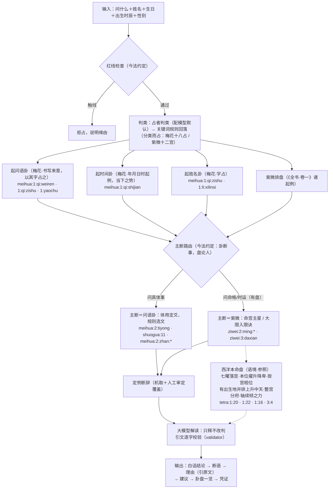

# 算法模块：从用户输入到输出的全流程

本文档是算法模块的合同：流程里的每一步做什么、依据哪部典籍的哪段原文
（`cite_id` 可用 `python -m tianwen.corpus --cite <编号>` 取全文核对）、
哪些环节是本项目的今法约定（无典可依时如实标注，不冒充古法）。
改流程必先改本文档，代码与文档不一致视为缺陷。

## 一、总则

1. **逐步有据**：每一个推演步骤，或有典籍原文为据（标 cite_id），或是
   如实标注的今法约定；二者必居其一，不允许"凭感觉"的中间步骤。
2. **单一结论**：多种占法同时使用，但吉凶只从主断一处出；其余占法只作
   "人的语境"入解读，不出第二个吉凶——结构上杜绝自相矛盾，而非靠措辞
   调和。
3. **非古籍明说，不用随机数**：全流程无随机数。梅花起卦由问语、时刻与姓名笔画
   确定，紫微排盘由生辰确定，同输入必同输出（可复现）。古籍明说用实物
   之变者（掷蓍、掷钱），在能接收真实掷象输入之前不以伪随机数代掷
   （见"七、暂不采用"）。
4. **结论先行**：先一句白话结论，再传统断语，再解释理由（解释时引古籍
   原文，逐字校验），卦盘细节与复现凭证作附录。
5. **占断可复现性**：起卦、排盘、选文、定例结论皆确定性代码，同输入必同；
   大模型解读非确定，以占断存证（SHA-256）为准。

## 二、输入（单一模式，五项）

| 输入 | 用途 | 需要的理由（书上怎么记载） |
|---|---|---|
| 问什么 | 红线检查、判类、**问语起卦（事类主断）**、占章选取、问事分宫 | 问语起卦：《为人占》「或以书写来意……则以其字占之」（`meihua:1:qi:weiren`）；分类而占是古法通例：《梅花易数》卷二分占十八类（`meihua:2:zhan:*`）、紫微按十二宫分事（`ziwei:2:gong:*`） |
| 姓名（两三字） | 姓名卦（论问者之位） | 字画起卦：二字两仪平分、三字三才（`meihua:1:qi:zishu`）；字画取数有明例（`meihua:1:li:xilinsi` 西林寺牌额占「以西字七画为艮」） |
| 生日（公历） | 紫微排盘；命理主断时另排西洋本命盘（语境） | 《紫微斗数全书》以生年干支、生月日时安宫定星（卷一诸起例，见排盘凭证）；西洋本命盘由生辰定七曜之位（托勒密《占星四书》，步骤 5b） |
| 出生时辰 | 紫微安命身宫；西洋本命盘取时辰中点起算 | 安命身以时辰起（《全书·卷一》）；时辰未知无法排盘，如实告之，不猜；时辰中点为今法约定（凭证列时辰两端月亮黄经，跨宫如实存疑） |
| 性别 | 紫微大限顺逆、男女命诀 | 阳男阴女顺行、阴男阳女逆行（《全书·卷一》起大限法）；入男命/女命吉凶诀按性别取（`ziwei:2:*`） |
| 出生地（东经、北纬，可缺） | 西洋本命盘上升与中天（宫位分府由上升起）；缺则只排七曜落宫，不以默认地冒充 | 上升为黄道与当地东方地平之交点，非有经纬不可得（步骤 5b）；生时难得准、上升度须以法推之出 `tetra:3:3`，故时辰精度之下两端跨宫如实存疑 |

姓名不合书例（单字须辨字形左右阴阳画、四字以上须古四声，皆非机器可断，
`meihua:1:qi:zishu`）则本次不起姓名卦并说明缘由；生辰不全则本次无盘，
其余照常——输入不全只减少参照，不改变流程形状。

## 三、流程图



## 四、每一步的典籍依据

按执行顺序。「约定」＝本项目今法约定，输出中如实标注，不冒充古法。

| # | 步骤 | 规则 | 依据 |
|---|---|---|---|
| 1 | 红线检查 | 医疗、生死、涉他人隐私等不占；关键词比对前繁体输入按内置繁简对照归一（判类规则、问事分宫两关键词层同此；对照表仅覆盖诸关键词表所涉字，起卦不归一——以所书之字占之，画数随所书字形） | 约定（DESIGN §2）；亦承「易为君子谋」之义，不据以为典 |
| 2 | 判类 | 用户指定最优先；配有模型默认由占者判类（温度 0，只择类不占断，提示词附各类落点与辨界），失败或判「其他」回落关键词规则；未配模型按关键词规则，来源如实标注 | 分类而占：梅花十八占（`meihua:2:zhan:*`）、紫微十二宫（`ziwei:2:gong:*`）；关键词表为约定 |
| 3 | 起问语卦与时间卦 | **问语卦（事类主断）**：问语只数汉字（标点、字母、数字非字不入数）。二三字依字画起（两仪平分／三才，同姓名卦法）；四字以上「字数分之」——少一半为上卦、多一半为下卦（均平则对半），各以字数配先天八卦；动爻＝（总字数＋时辰数）除六——「取爻当以时加之」，时辰由此入卦。**时间卦恒起**（年支＋月＋日除八为上卦，加时辰数除八为下卦，总数除六取动爻），自 v3.5 起降为「当下之势」语境。问语无汉字可数则回落时间卦代主断并声明 | 问语卦：`meihua:1:qi:weiren`（为人占「或以书写来意……则以其字占之」「听其语声……即如其字数分之起卦」）、`meihua:1:qi:zishu`（「十一字以上……止用字数。如字数均平，则以半为上卦，以半为下卦」）、`meihua:1:qi:zi`（字占「如字数不匀，即少一字为上卦，取天轻清之义」）、`meihua:1:yaochu`（爻以六除「取爻当以时加之」）。**约定标注**：四至十字书例用平仄声调取数（平一上二去三入四，古四声含入声），无四声底本不可机断，故一律字数分之（同听语声例），四声韵书缓收录 PROOFREADING；动爻加时从「爻以六除」通例（姓名卦不加时，从西林寺例——所占者字，非时事）。时间卦：`meihua:1:qi:shijian`（年月日时起例）、`meihua:1:guachu`（卦以八除）、`meihua:1:guashu`（周易卦数） |
| 4 | 起姓名卦 | 二字两仪平分：一字上卦、一字下卦；三字三才：一字上卦、二字下卦；各取总笔画配卦，总画数除六取动爻 | `meihua:1:qi:zishu`（一字占至十一字占）、`meihua:1:li:xilinsi`（西林寺牌额占，字画取数、动爻不加时之例）；笔画数依 Unihan kTotalStrokes（数据表约定，凭证逐字列画数） |
| 5 | 紫微排盘 | 定局安星、命身十二宫、大限顺逆，全依《全书·卷一》诸起例；杂曜天刑天姚依《安天刑天姚星诀》（酉／丑上起正月顺至本生月，月数与安命身同依闰月约定），截路空亡依《安截路空亡诀》论本生年干（甲己申酉、乙庚午未、丙辛辰巳、丁壬寅卯、戊癸子丑），旬中空亡依《安旬中空亡诀》论本生年干支所在之旬（甲子旬空戌亥……甲戌旬空申酉），空亡标于宫、盘面与凭证如实列出 | 排盘凭证逐项标注（`ziwei:1:*` 起例文）；阳男阴女顺逆行出《卷一·起大限法》；安星诸诀出《全书·卷二》，逐条注于 chart.py |
| 5b | 西洋本命盘（命理主断时另排） | 七曜（日月与五星，托勒密所论诸曜）地心视黄经由星历数据表确定性算出（VSOP87D 截断＋Meeus 月表，来源与对照实测误差记于 data/ephemeris.json meta 并进凭证）；落宫＝⌊视黄经/30°⌋（tropical，白羊起于春分点，date 真春分）；本位／擢升／降卑按诀转码；相位按宫距（对分六宫 180°、三分四宫 120°、四分三宫 90°、六分二宫 60°，三分六分为和、对分四分为不和；同宫并列如实列出、非相位）。**有出生地则并排上升与中天**：视恒星时（GMST，Meeus 12.4＋章动 Δψ·cosε）加东经得 RAMC，中天 λ_MC＝atan2(sin RAMC, cos RAMC·cos ε)、上升 λ_Asc＝atan2(cos RAMC, −(sin RAMC·cos ε＋tan φ·sin ε))（ε 为真黄赤交角，Meeus 22.2＋Δε 主项）；分府用整宫之法：上升所在宫为第一府（机断约定，凭证标注），第一、四、七、十府为轴宫、第二、五、八、十一为续宫、余为倾宫，诸曜各标其府与轴续倾之力；上升与中天时辰内约行 30°，时辰两端黄经进凭证，两端跨宫则如实存疑、上升与分府之文勿引；极圈纬度（\|φ\|≥66.5°）上升无恒常定义，不算并声明。今法约定（凭证如实标注）：生辰北京时间折 UTC（同紫微）、时辰中点起算（月亮时辰两端黄经进凭证，跨宫则落宫存疑、涉月之文勿引）、出生地未填则不算上升与宫位分府（不以默认地冒充）。只入解读语境，可引不可断 | `tetra:1:20`（本位：日狮子月巨蟹土摩羯宝瓶木人马双鱼火白羊天蝎金金牛天秤水双子室女）、`tetra:1:22`（擢升与降卑逐星明说）、`tetra:1:16`（相位按宫距与和/不和）；宫界以回归点定出 `tetra:1:12`；轴宫续宫为力（尤以上升中天为最）、自轴倾落为弱、中天主职业之所皆出 `tetra:3:4`；生时难得准、上升度须以法推之出 `tetra:3:3`（时辰精度存疑之义所本）；整宫分府为机断约定（原文无明表，不冒充典籍）；星历为数据表约定（非典籍，见 PROOFREADING） |
| 6 | 主断路由 | 问具体事→问语卦主断（问语无汉字则时间卦代之并声明）；问命格/时运且有盘→紫微主断（无盘则问语卦代断并声明局限） | 约定「卦断事，盘论人」（DESIGN §6.1）；渊源《全书》以盘论人之体例，不据以为典 |
| 7 | 体用与选文（卦侧） | 动爻所在之卦为用、不动为体；动爻爻辞主断，本卦、之卦卦辞为参；体用取象入解读（说卦广象＋《梅花》万物属类逐卦附于体用之下）；所问有对应占章则附 | `meihua:2:tiyong`（体用总诀）、`shuogua:11`（广象）＋`shuogua:7`（性情）＋`meihua:1:xiang:wanwu:*`（八卦万物属类，按体用两卦逐卦附取）、`meihua:2:zhan:*`（十八占之所问类） |
| 8 | 选文（盘侧） | 命格→命宫主星论断文＋分宫格＋男女命诀＋诸星问答，另按安命宫支机取合格诀／破格诀（只作参照，须对照盘面），并判《卷一》定富贵贫贱诸局——诀文自述星曜宫位条件可机判者逐条对照盘面认局，认出之局连同盘面依据入语境，不可机判者（诀作「见前批注」、文义两可、定杂局论限运）不判且凭证列明缘由；时运→现行大限入限诀＋《论大限十年祸福何如》，流年列太岁与小限所在之宫、太岁冲二限冲羊陀七杀逐项查验、小限宫主星附入限诀为参（结论仍单源）；问事涉具体题材加取所涉之宫 | `ziwei:2:ming:*`、`ziwei:2:*jue*`、`ziwei:1:wenda:*`、`ziwei:1:hege:*`／`ziwei:1:poge:*`、`ziwei:1:ju:*`（定富贵贫贱杂诸局；判定式之文义约定——夹＝邻宫、拱＝三合、向＝对宫、冲＝对宫、「同守身命」＝分守身命二宫、「反背」依庙陷表失陷、「逢巨暗」承「命坐空亡逢廉贞」句例解作巨门守命、「遇吉」＝同宫见吉曜、「庙旺」只取庙旺两级、「四杀守身命临陷地」＝四杀之星分守身命二宫且所见皆陷、「坐空亡」「落空亡」＝其宫之支属截路空亡或旬中空亡（其一即坐）、「同临身命」（刑囚夹印）依字面解作二星同宫而其宫为命宫或身宫（天刑廉贞可同宫，无须如武贞改读分守）、「两杀」（禄逢两杀）即空劫（禄存之宫坐空亡又见地空或地劫）——patterns.py 逐局注明）、`ziwei:3:daxian`、`ziwei:3:erxian`（小限起宫出《卷二·安小限诀》，太岁即当年年支）、`ziwei:2:gong:*` |
| 9 | 定例断辞 | 主断经文断辞字样（吉凶悔吝厉无咎…）按明示优先级机取归类；审定记两处（audited 如实标注）：订正个案按 cite_id 覆盖（verdict_overrides.json），审定确认名单（verdict_audit.json）内机取维持而 audited 置真 | 断辞字样即经文本文；提取优先级为约定（verdict.py 表）；审定轮次与方法录 data/PROOFREADING.md |
| 10 | 语境合参 | 非主断的占法只作"人的语境"入解读：时间卦论当下之势（两种主断下皆然），姓名卦论问者之位，紫微盘论秉性禀赋（问事时），西洋本命盘作异邦占法之参照（命理主断时；语境块附盘面事实＋《占星四书》总纲章 1:5/1:16/1:20/1:22 恒附、论题章按判类与题材附——命格 3:18、时运 4:10、题材经分宫映射取卷三卷四对应章；有出生地并附上升中天分府事实与 3:4（轴续倾强弱）、3:3（生时难准之义）两章；寿夭疾病生死诸章属红线主题不附，藏书仍可检索）；均不出第二吉凶。语境原文可引不可断：卦侧语境备经（爻辞、卦辞）、传（小象、彖）、注（动爻王弼注）各一体，西洋本命盘备盘面事实与《占星四书》章句，解读宜择要参引为佐（旁征博引）——提示语明言命理主断附西洋盘时宜在理由中至少参及一次其盘面事实（七曜落宫、得位、相位、上升分府，转述即可、不受引文校验；引《占星四书》原文则须逐字英文），存疑标注之项勿参。盘为主断时另设书桌块：按主断宫主星星名——问涉具体题材时并以所涉之宫名（问事类别经分宫映射归于宫名）——自《卷一》赋文格诀池机械召回候选断语，召回规则与命中数进凭证，池内择引、不合盘面者勿引 | 约定（DESIGN §6.2 之推广）；解读层硬性规则＋校验器共同保证 |
| 11 | 大模型解读 | 只可引用给定原文，逐字校验（汉文单元以汉字比对；拉丁字底本单元如《占星四书》英译以小写字母数字比对——中译引文对拉丁单元规整必为空，结构上保证「引原语底本、中译只作转述」之引文约定）；断语须标 cite_id 且所据须含主断侧经传之文；王弼注、说卦取象不得单独立断；定例断辞为对照基准，异断须明据；输出字段类型不符同样作校验错误反馈重试（多段理由输出为字符串数组则合并收下），校验器只报错不抛异常 | 约定（校验器 validator.py 是最后一道确定性闸门）；引文约定（DESIGN，用户定于 2026-08） |
| 12 | 输出 | 结论先行：白话结论→断语→理由（引原文）→建议→卦盘一览→凭证→免责声明 | 约定（本文档一.4） |

## 五、多占法并用而不自相矛盾

四样同起（问语卦、时间卦、姓名卦、紫微盘），但**吉凶只有一个出处**：

- 主断唯一：第 6 步路由后，只有主断侧产出定例断辞与占断；
- 语境不断：其余占法的原文以「语境」身份进入解读层，提示语与校验器
  双重禁止其产出第二个吉凶（校验器要求断语所据必须落在主断侧文本上）；
- 语境可引：不立断不等于不引用——理由中宜择要参引语境原文（逐字、
  标出处）以佐主断之势，旁征博引而主次分明；引文校验一体覆盖；
- 书桌（确定性召回层）：盘为主断时按主断宫主星星名（问涉具体题材时
  并以所涉之宫名）自赋文格诀池机械召回候选断语入语境，召回规则与
  命中数进凭证；候选未必尽合此盘，提示语令其对照盘面择引，校验器
  保证其不得立断；
- 格局判定（问命格时）：《卷一》定富贵贫贱诸局之诀文条件可机判者
  逐条对照盘面认局，认出之局连同盘面依据入语境（已合盘面，可引
  不可断）；不可机判者不判、缘由进凭证——认局只增语境，不改主断唯一；
- 西洋本命盘（命理主断时）：同为生辰确定之盘，以异邦占法作参照
  语境——盘面事实（七曜落宫、本位擢升降卑、按宫相位；有出生地并
  上升中天、整宫分府与轴续倾之力）确定性算出，《占星四书》总纲章
  与论题章附入可引；引文须逐字照录英译原文（校验器拉丁通道），
  中译只作转述；不得据以立断或另出吉凶；
- 角色分工（约定）：问语卦断事之吉凶（以书写来意起，所问不同则卦不同），
  时间卦论当下之势，姓名卦论问者之位，紫微盘论秉性禀赋与限运之势，
  西洋本命盘为异邦之参。各占法内部逐步有据；分工本身是今法约定。

## 六、输出格式

```
【结论】<白话一两句：直接回答所问>
【断语】<传统断辞句，句末标出处>
【理由】<两至四段，引古籍原文（逐字校验）并解释，段末标出处>
【建议】<2–4 条，可执行>
── 卦盘一览 ──（每占法一两行：卦名/动爻/体用；命宫主星；均标凭证所在）
── 凭证（可复现）──（取数、算式、约定；同输入必同输出）
※ 免责声明
```

出处标注：内部编号（cite_id）只在校验层流转；对外展示一律换成古籍
原名（如〔《周易·革·九五》爻辞〕，report.humanize），未知编号原样
保留不吞不改。`corpus --cite` 书名与编号皆认，读者按原名即可取全文。

风格约定（说人话）：结论与理由须如占者当面说话——有画面、有比方，
善以卦象之象作喻，落到问者生活场景，忌公文腔与术语罗列。可言势之
成色与档次，但须有着落：原文有富贵贫贱等第之语者可白话转述并标出处，
以象引申亦可言成色（「利艰贞」是辛苦财）；不得自造原文没有的档次，
不得许诺具体数额、时限或必然结果（「富可敌国」式无据之许，不做）。

无模型（--no-llm 或未配 Key）时，【结论】取定例断辞之白话（verdict 表），
【理由】为主断经文原文，格式不变。

## 七、暂不采用的占法（及其缘由）

| 占法 | 缘由 | 启用条件 |
|---|---|---|
| 铜钱法（六爻） | 《卜筮正宗》明说掷真钱；以伪随机数代掷非古籍明说（总则 3）。代码留存（`casting.cast_coin`、朱子占法选文 `selection.select_zhuzi`） | 能接收用户真实掷钱结果输入时启用 |
| 大衍筮法 | 典据已入库（`xici:shang:9`「大衍之数五十」），但分二挂一为实物之变，同理不以伪随机代 | 同上（真实分蓍输入） |
| 一字占 | 须辨字形左右阴阳画（`meihua:1:qi:zishu`），无字形数据，机器不可断 | 有逐字左右画形数据时 |
| 四字以上姓名 | 书云「不必数画数，只以平仄声音调之」，须古四声之学 | 收录中古音声调数据时 |
| 梅花万物类象入选文 | `meihua:1:xiang:wanwu:*` 全文过长，整段入池有违"输出精简"；需按问类摘句机制 | 设计出有据的按类摘句规则时 |
| 西洋占星（其余部分） | 本命盘语境层已启用（v3.9 七曜落宫诸事；v3.10 上升中天与整宫分府——出生地经纬为可缺输入，未填不排、不以默认地冒充；时辰精度下上升中天两端跨宫如实存疑）。其余缓用：**主断化**（据《占星四书》出定例断辞）须先解决其吉凶判据之机取，另议；**上升度以法推定**（tetra:3:3 之 animodar 法，可解时辰精度之疑）须先算朔望与界（terms）表，另议；希腊原文底本待公版电子文本（PROOFREADING） | 主断判据设计；朔望与界表；公版希腊文电子文本 |
| 塔罗等洗牌之法 | 须洗牌，按总则 3 不以伪随机代 | 真实洗牌结果输入 |

## 八、与模块的关系

- 数据模块供给本流程的一切原文：`corpus.get(cite_id)` 逐条可核；
- 本文档描述算法模块（topic / redline / casting / lunar / strokes /
  ziwei.chart / astro.ephemeris / astro.natal / selection / verdict /
  llm / validator / service）；
- 前端模块（cli / gui / report）只做输入输出，不含推演逻辑。
