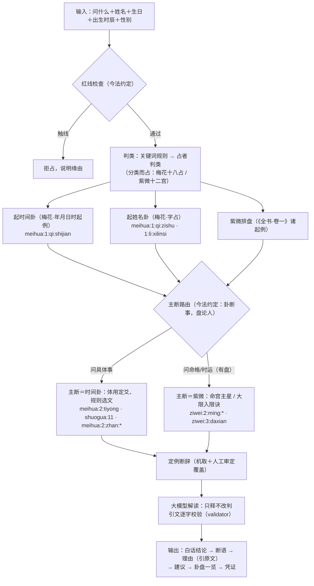

# 算法模块：从用户输入到输出的全流程

本文档是算法模块的合同：流程里的每一步做什么、依据哪部典籍的哪段原文
（`cite_id` 可用 `python -m yijing_agent.corpus --cite <编号>` 取全文核对）、
哪些环节是本项目的今法约定（无典可依时如实标注，不冒充古法）。
改流程必先改本文档，代码与文档不一致视为缺陷。

## 一、总则

1. **逐步有据**：每一个推演步骤，或有典籍原文为据（标 cite_id），或是
   如实标注的今法约定；二者必居其一，不允许"凭感觉"的中间步骤。
2. **单一结论**：多种占法同时使用，但吉凶只从主断一处出；其余占法只作
   "人的语境"入解读，不出第二个吉凶——结构上杜绝自相矛盾，而非靠措辞
   调和。
3. **非古籍明说，不用随机数**：全流程无随机数。梅花起卦由时刻与姓名笔画
   确定，紫微排盘由生辰确定，同输入必同输出（可复现）。古籍明说用实物
   之变者（掷蓍、掷钱），在能接收真实掷象输入之前不以伪随机数代掷
   （见"七、暂不采用"）。
4. **结论先行**：先一句白话结论，再传统断语，再解释理由（解释时引古籍
   原文，逐字校验），卦盘细节与复现凭证作附录。
5. **占断可复现性**：起卦、排盘、选文、定例结论皆确定性代码，同输入必同；
   大模型解读非确定，以占断存证（SHA-256）为准。

## 二、输入（单一模式，五项）

| 输入 | 用途 | 需要的理由（书上怎么记载） |
|---|---|---|
| 问什么 | 红线检查、判类、占章选取、问事分宫 | 分类而占是古法通例：《梅花易数》卷二分占十八类（`meihua:2:zhan:*`）、紫微按十二宫分事（`ziwei:2:gong:*`） |
| 姓名（两三字） | 姓名卦（论问者之位） | 字画起卦：二字两仪平分、三字三才（`meihua:1:qi:zishu`）；字画取数有明例（`meihua:1:li:xilinsi` 西林寺牌额占「以西字七画为艮」） |
| 生日（公历） | 紫微排盘 | 《紫微斗数全书》以生年干支、生月日时安宫定星（卷一诸起例，见排盘凭证） |
| 出生时辰 | 紫微安命身宫 | 安命身以时辰起（《全书·卷一》）；时辰未知无法排盘，如实告之，不猜 |
| 性别 | 紫微大限顺逆、男女命诀 | 阳男阴女顺行、阴男阳女逆行（《全书·卷一》起大限法）；入男命/女命吉凶诀按性别取（`ziwei:2:*`） |

姓名不合书例（单字须辨字形左右阴阳画、四字以上须古四声，皆非机器可断，
`meihua:1:qi:zishu`）则本次不起姓名卦并说明缘由；生辰不全则本次无盘，
其余照常——输入不全只减少参照，不改变流程形状。

## 三、流程图



## 四、每一步的典籍依据

按执行顺序。「约定」＝本项目今法约定，输出中如实标注，不冒充古法。

| # | 步骤 | 规则 | 依据 |
|---|---|---|---|
| 1 | 红线检查 | 医疗、生死、涉他人隐私等不占 | 约定（DESIGN §2）；亦承「易为君子谋」之义，不据以为典 |
| 2 | 判类 | 关键词规则优先；未中而配有模型则占者判类，来源如实标注 | 分类而占：梅花十八占（`meihua:2:zhan:*`）、紫微十二宫（`ziwei:2:gong:*`）；关键词表为约定 |
| 3 | 起时间卦 | 年支＋月＋日之和除八为上卦，加时辰数除八为下卦，总数除六取动爻；数配先天八卦 | `meihua:1:qi:shijian`（年月日时起例）、`meihua:1:guachu`（卦以八除）、`meihua:1:yaochu`（爻以六除）、`meihua:1:guashu`（周易卦数） |
| 4 | 起姓名卦 | 二字两仪平分：一字上卦、一字下卦；三字三才：一字上卦、二字下卦；各取总笔画配卦，总画数除六取动爻 | `meihua:1:qi:zishu`（一字占至十一字占）、`meihua:1:li:xilinsi`（西林寺牌额占，字画取数、动爻不加时之例）；笔画数依 Unihan kTotalStrokes（数据表约定，凭证逐字列画数） |
| 5 | 紫微排盘 | 定局安星、命身十二宫、大限顺逆，全依《全书·卷一》诸起例 | 排盘凭证逐项标注（`ziwei:1:*` 起例文）；阳男阴女顺逆行出《卷一·起大限法》 |
| 6 | 主断路由 | 问具体事→时间卦主断；问命格/时运且有盘→紫微主断（无盘则时间卦代断并声明局限） | 约定「卦断事，盘论人」（DESIGN §6.1）；渊源《全书》以盘论人之体例，不据以为典 |
| 7 | 体用与选文（卦侧） | 动爻所在之卦为用、不动为体；动爻爻辞主断，本卦、之卦卦辞为参；体用取象入解读；所问有对应占章则附 | `meihua:2:tiyong`（体用总诀）、`shuogua:11`（广象）＋`shuogua:7`（性情）、`meihua:2:zhan:*`（十八占之所问类） |
| 8 | 选文（盘侧） | 命格→命宫主星论断文＋分宫格＋男女命诀＋诸星问答；时运→现行大限入限诀＋《论大限十年祸福何如》；问事涉具体题材加取所涉之宫 | `ziwei:2:ming:*`、`ziwei:2:*jue*`、`ziwei:1:wenda:*`、`ziwei:3:daxian`、`ziwei:2:gong:*` |
| 9 | 定例断辞 | 主断经文断辞字样（吉凶悔吝厉无咎…）按明示优先级机取归类；人工审定按 cite_id 覆盖（audited 如实标注） | 断辞字样即经文本文；提取优先级为约定（verdict.py 表） |
| 10 | 语境合参 | 非主断的占法只作"人的语境"入解读：姓名卦论问者之位，紫微盘论秉性禀赋（问事时）或时间卦论当下之势（命理时）；均不出第二吉凶 | 约定（DESIGN §6.2 之推广）；解读层硬性规则＋校验器共同保证 |
| 11 | 大模型解读 | 只可引用给定原文，逐字校验；断语须标 cite_id 且所据须含主断侧经传之文；王弼注、说卦取象不得单独立断；定例断辞为对照基准，异断须明据 | 约定（校验器 validator.py 是最后一道确定性闸门） |
| 12 | 输出 | 结论先行：白话结论→断语→理由（引原文）→建议→卦盘一览→凭证→免责声明 | 约定（本文档一.4） |

## 五、多占法并用而不自相矛盾

三种占法同时起（时间卦、姓名卦、紫微盘），但**吉凶只有一个出处**：

- 主断唯一：第 6 步路由后，只有主断侧产出定例断辞与占断；
- 语境不断：其余占法的原文以「语境」身份进入解读层，提示语与校验器
  双重禁止其产出第二个吉凶（校验器要求断语所据必须落在主断侧文本上）；
- 角色分工（约定）：时间卦断事之吉凶，姓名卦论问者之位，紫微盘论
  秉性禀赋与限运之势。各占法内部逐步有据；分工本身是今法约定。

## 六、输出格式

```
【结论】<白话一两句：直接回答所问>
【断语】<传统断辞句，句末标 [cite_id]>
【理由】<两至四段，引古籍原文（逐字校验）并解释>
【建议】<2–4 条，可执行>
── 卦盘一览 ──（每占法一两行：卦名/动爻/体用；命宫主星；均标凭证所在）
── 凭证（可复现）──（取数、算式、约定；同输入必同输出）
※ 免责声明
```

无模型（--no-llm 或未配 Key）时，【结论】取定例断辞之白话（verdict 表），
【理由】为主断经文原文，格式不变。

## 七、暂不采用的占法（及其缘由）

| 占法 | 缘由 | 启用条件 |
|---|---|---|
| 铜钱法（六爻） | 《卜筮正宗》明说掷真钱；以伪随机数代掷非古籍明说（总则 3）。代码留存（`casting.cast_coin`、朱子占法选文 `selection.select_zhuzi`） | 能接收用户真实掷钱结果输入时启用 |
| 大衍筮法 | 典据已入库（`xici:shang:9`「大衍之数五十」），但分二挂一为实物之变，同理不以伪随机代 | 同上（真实分蓍输入） |
| 一字占 | 须辨字形左右阴阳画（`meihua:1:qi:zishu`），无字形数据，机器不可断 | 有逐字左右画形数据时 |
| 四字以上姓名 | 书云「不必数画数，只以平仄声音调之」，须古四声之学 | 收录中古音声调数据时 |
| 梅花万物类象入选文 | `meihua:1:xiang:wanwu:*` 全文过长，整段入池有违"输出精简"；需按问类摘句机制 | 设计出有据的按类摘句规则时 |
| 西方占法 | 西洋占星本命盘由生辰确定、无随机，且有公版典籍（如托勒密《占星四书》）可依，合本流程原则，为候选；塔罗等须洗牌之法按总则 3 暂缓 | 数据模块收录公版底本并逐字有据后 |

## 八、与模块的关系

- 数据模块供给本流程的一切原文：`corpus.get(cite_id)` 逐条可核；
- 本文档描述算法模块（topic / redline / casting / lunar / strokes /
  ziwei.chart / selection / verdict / llm / validator / service）；
- 前端模块（cli / gui / report）只做输入输出，不含推演逻辑。
